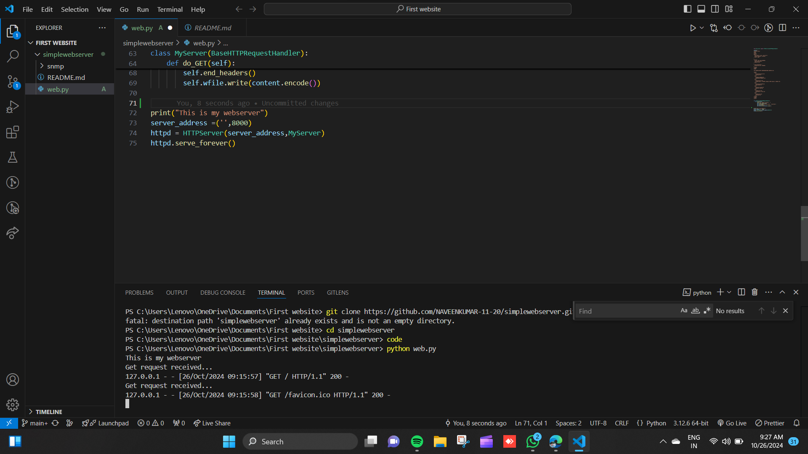

# EX01 Developing a Simple Webserver
## Date: 24.10.2024

## AIM:
To develop a simple webserver to serve html pages and display the configuration details of laptop.

## DESIGN STEPS:
### Step 1: 
HTML content creation.

### Step 2:
Design of webserver workflow.

### Step 3:
Implementation using Python code.

### Step 4:
Serving the HTML pages.

### Step 5:
Testing the webserver.

## PROGRAM:
'''
from http.server import HTTPServer,BaseHTTPRequestHandler

content='''
<!DOCTYPE html>
<html>
<head>

</head>
<body>

<h2>
LAPTOP CONFRIGURATIONS
</h2>

<table>
  <tr>
    <th>Configuration</th>
    <th>Value</th>
  </tr>
  <tr>
    <td>Device Name</td>
    <td>DESKTOP-GQEUIBF</td>
  </tr>
  <tr>
    <td>Processor</td>
    <td>AMD Ryzen 7 73709HR w/Radeon 780M Graphics 3.80GHz</td>
  </tr>
  <tr>
    <td>Installed RAM</td>
    <td>16.0GB</td>
  </tr>
  <tr>
    <td>System Type</td>
    <td>64.bit OS</td>
  </tr>
  <tr>
    <td>Edition</td>
    <td>Windows 11 HSL</td>
  </tr>
  <tr>
    <td>Version</td>
    <td>21H2</td>
  </tr>
</table>
</body>
</html>
'''

class MyServer(BaseHTTPRequestHandler):
    def do_GET(self):
        print("Get request received...")
        self.send_response(200) 
        self.send_header("content-type", "text/html")       
        self.end_headers()
        self.wfile.write(content.encode())

print("This is my webserver") 
server_address =('',8000)
httpd = HTTPServer(server_address,MyServer)
httpd.serve_forever()
'''

## OUTPUT:

## RESULT:
The program for implementing simple webserver is executed successfully.
